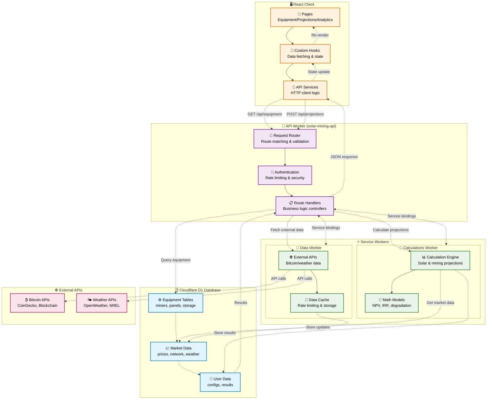

```mermaid
graph TD
    %% Client Layer
    subgraph CLIENT["🖥️ React Client"]
        direction TB
        PAGES["📄 Pages<br/>Equipment/Projections/Analytics"]
        HOOKS["🎣 Custom Hooks<br/>Data fetching & state"]
        SERVICES["🔌 API Services<br/>HTTP client logic"]
        
        PAGES --> HOOKS
        HOOKS --> SERVICES
    end
    
    %% API Gateway Layer
    subgraph API_WORKER["🔗 API Worker (solar-mining-api)"]
        direction TB
        ROUTER["🚦 Request Router<br/>Route matching & validation"]
        AUTH["🔐 Authentication<br/>Rate limiting & security"]
        HANDLERS["📋 Route Handlers<br/>Business logic controllers"]
        
        ROUTER --> AUTH
        AUTH --> HANDLERS
    end
    
    %% Service Layer
    subgraph SERVICES_LAYER["⚡ Service Workers"]
        direction TB
        
        subgraph CALC_WORKER["🧮 Calculations Worker"]
            CALC_ENGINE["📊 Calculation Engine<br/>Solar & mining projections"]
            CALC_MODELS["📐 Math Models<br/>NPV, IRR, degradation"]
        end
        
        subgraph DATA_WORKER["📡 Data Worker"]
            DATA_FETCHER["🌐 External APIs<br/>Bitcoin/weather data"]
            DATA_CACHE["💾 Data Cache<br/>Rate limiting & storage"]
        end
        
        CALC_ENGINE --> CALC_MODELS
        DATA_FETCHER --> DATA_CACHE
    end
    
    %% Database Layer
    subgraph DATABASE["🗄️ Cloudflare D1 Database"]
        direction TB
        EQUIPMENT_TABLES["⚙️ Equipment Tables<br/>miners, panels, storage"]
        DATA_TABLES["📈 Market Data<br/>prices, network, weather"]
        USER_TABLES["👤 User Data<br/>configs, results"]
        
        EQUIPMENT_TABLES -.-> DATA_TABLES
        DATA_TABLES -.-> USER_TABLES
    end
    
    %% External APIs
    subgraph EXTERNAL["🌐 External APIs"]
        direction TB
        BITCOIN_API["₿ Bitcoin APIs<br/>CoinGecko, Blockchain"]
        WEATHER_API["🌤️ Weather APIs<br/>OpenWeather, NREL"]
    end
    
    %% Request Flow Paths
    
    %% 1. Equipment Data Flow
    SERVICES -.->|"GET /api/equipment"| ROUTER
    HANDLERS -.->|"Query equipment"| EQUIPMENT_TABLES
    
    %% 2. Projection Calculation Flow
    SERVICES -.->|"POST /api/projections"| ROUTER
    HANDLERS -.->|"Calculate projections"| CALC_ENGINE
    CALC_ENGINE -.->|"Get market data"| DATA_TABLES
    CALC_ENGINE -.->|"Store results"| USER_TABLES
    
    %% 3. Data Update Flow
    HANDLERS -.->|"Fetch external data"| DATA_FETCHER
    DATA_FETCHER -.->|"API calls"| BITCOIN_API
    DATA_FETCHER -.->|"API calls"| WEATHER_API
    DATA_CACHE -.->|"Store updates"| DATA_TABLES
    
    %% 4. Inter-service Communication
    HANDLERS <-.->|"Service bindings"| CALC_WORKER
    HANDLERS <-.->|"Service bindings"| DATA_WORKER
    
    %% Response Flow (dotted lines going back up)
    USER_TABLES -.->|"Results"| HANDLERS
    HANDLERS -.->|"JSON response"| SERVICES
    SERVICES -.->|"State update"| HOOKS
    HOOKS -.->|"Re-render"| PAGES
    
    %% Styling
    classDef clientNode fill:#fff3e0,stroke:#ef6c00,stroke-width:2px,color:#000
    classDef apiNode fill:#f3e5f5,stroke:#7b1fa2,stroke-width:2px,color:#000
    classDef serviceNode fill:#e8f5e8,stroke:#2e7d32,stroke-width:2px,color:#000
    classDef dbNode fill:#e1f5fe,stroke:#0277bd,stroke-width:2px,color:#000
    classDef extNode fill:#fce4ec,stroke:#c2185b,stroke-width:2px,color:#000
    
    class PAGES,HOOKS,SERVICES clientNode
    class ROUTER,AUTH,HANDLERS apiNode
    class CALC_ENGINE,CALC_MODELS,DATA_FETCHER,DATA_CACHE serviceNode
    class EQUIPMENT_TABLES,DATA_TABLES,USER_TABLES dbNode
    class BITCOIN_API,WEATHER_API extNode
```