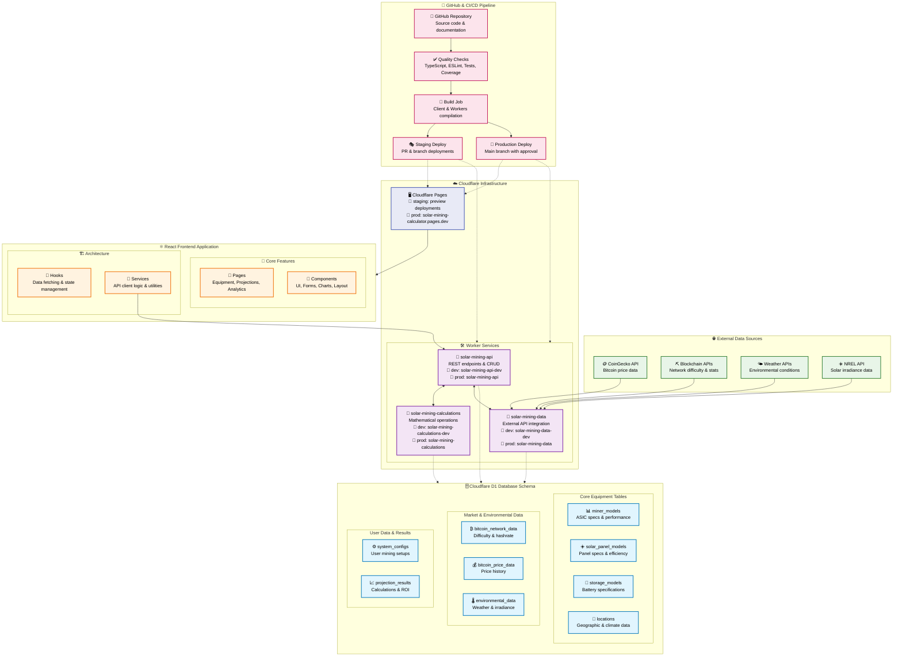

```mermaid
graph TD
    %% External Data Sources (Top Left)
    subgraph EXT["🌐 External Data Sources"]
        direction TB
        EXT1["🪙 CoinGecko API<br/>Bitcoin price data"]
        EXT2["⛏️ Blockchain APIs<br/>Network difficulty & stats"]
        EXT3["🌤️ Weather APIs<br/>Environmental conditions"]
        EXT4["☀️ NREL API<br/>Solar irradiance data"]
    end

    %% GitHub & CI/CD (Top Right)
    subgraph CICD["🔄 GitHub & CI/CD Pipeline"]
        direction TB
        REPO["📁 GitHub Repository<br/>Source code & documentation"]
        QUALITY["✅ Quality Checks<br/>TypeScript, ESLint, Tests, Coverage"]
        BUILD["🔨 Build Job<br/>Client & Workers compilation"]
        DEPLOY_STAGE["🎭 Staging Deploy<br/>PR & branch deployments"]
        DEPLOY_PROD["🚀 Production Deploy<br/>Main branch with approval"]
        
        REPO --> QUALITY
        QUALITY --> BUILD
        BUILD --> DEPLOY_STAGE
        BUILD --> DEPLOY_PROD
    end

    %% Cloudflare Infrastructure (Center)
    subgraph CF["☁️ Cloudflare Infrastructure"]
        direction TB
        
        PAGES["🖥️ Cloudflare Pages<br/>🔧 staging: preview deployments<br/>🚀 prod: solar-mining-calculator.pages.dev"]
        
        subgraph WORKERS["🛠️ Worker Services"]
            direction TB
            API["🔗 solar-mining-api<br/>REST endpoints & CRUD<br/>🔧 dev: solar-mining-api-dev<br/>🚀 prod: solar-mining-api"]
            CALC["🧮 solar-mining-calculations<br/>Mathematical operations<br/>🔧 dev: solar-mining-calculations-dev<br/>🚀 prod: solar-mining-calculations"]
            DATA["📡 solar-mining-data<br/>External API integration<br/>🔧 dev: solar-mining-data-dev<br/>🚀 prod: solar-mining-data"]
        end
    end

    %% Database Schemas (Center)
    subgraph DB["🗄️ Cloudflare D1 Database Schema"]
        direction TB
        subgraph DB_CORE["Core Equipment Tables"]
            DB1["📊 miner_models<br/>ASIC specs & performance"]
            DB2["☀️ solar_panel_models<br/>Panel specs & efficiency"]
            DB3["🔋 storage_models<br/>Battery specifications"]
            DB4["📍 locations<br/>Geographic & climate data"]
        end
        
        subgraph DB_DATA["Market & Environmental Data"]
            DB5["₿ bitcoin_network_data<br/>Difficulty & hashrate"]
            DB6["💰 bitcoin_price_data<br/>Price history"]
            DB7["🌡️ environmental_data<br/>Weather & irradiance"]
        end
        
        subgraph DB_USER["User Data & Results"]
            DB8["⚙️ system_configs<br/>User mining setups"]
            DB9["📈 projection_results<br/>Calculations & ROI"]
        end
    end

    %% React Frontend (Bottom)
    subgraph FE["⚛️ React Frontend Application"]
        direction TB
        
        subgraph CORE_FEATURES["📱 Core Features"]
            direction TB
            PAGES_FE["📄 Pages<br/>Equipment, Projections, Analytics"]
            COMPONENTS["🧩 Components<br/>UI, Forms, Charts, Layout"]
        end
        
        subgraph ARCHITECTURE["🏗️ Architecture"]
            direction TB
            HOOKS["🎣 Hooks<br/>Data fetching & state management"]
            SERVICES["🔌 Services<br/>API client logic & utilities"]
        end
    end

    %% Data Flow Connections
    
    %% External data to Data Worker
    EXT1 --> DATA
    EXT2 --> DATA
    EXT3 --> DATA
    EXT4 --> DATA

    %% Workers to Database
    API -.-> DB
    CALC -.-> DB
    DATA -.-> DB

    %% Inter-worker Communication
    API <--> CALC
    API <--> DATA

    %% Frontend to API
    SERVICES --> API
    
    %% CI/CD to Infrastructure
    DEPLOY_STAGE -.-> WORKERS
    DEPLOY_STAGE -.-> PAGES
    DEPLOY_PROD -.-> WORKERS
    DEPLOY_PROD -.-> PAGES
    
    %% Pages hosts Frontend
    PAGES --> FE

    %% Styling
    classDef dbNode fill:#e1f5fe,stroke:#0277bd,stroke-width:2px,color:#000
    classDef workerNode fill:#f3e5f5,stroke:#7b1fa2,stroke-width:2px,color:#000
    classDef extNode fill:#e8f5e8,stroke:#2e7d32,stroke-width:2px,color:#000
    classDef feNode fill:#fff3e0,stroke:#ef6c00,stroke-width:2px,color:#000
    classDef cicdNode fill:#fce4ec,stroke:#c2185b,stroke-width:2px,color:#000
    classDef pagesNode fill:#e8eaf6,stroke:#3f51b5,stroke-width:2px,color:#000

    class DB1,DB2,DB3,DB4,DB5,DB6,DB7,DB8,DB9 dbNode
    class API,CALC,DATA workerNode
    class EXT1,EXT2,EXT3,EXT4 extNode
    class PAGES_FE,COMPONENTS,HOOKS,SERVICES feNode
    class REPO,QUALITY,BUILD,DEPLOY_STAGE,DEPLOY_PROD cicdNode
    class PAGES pagesNode
```