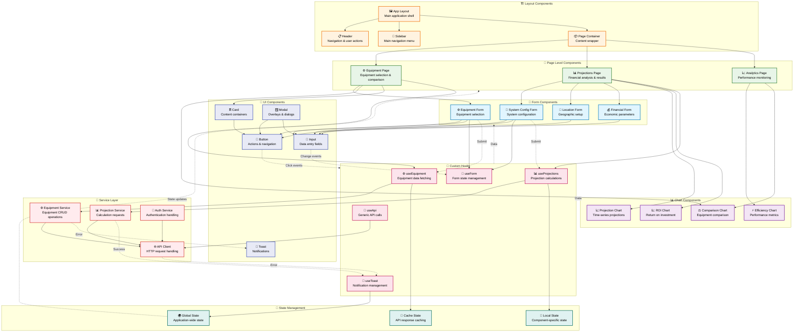

```mermaid
graph TD
    %% Page Level Components
    subgraph PAGES["📄 Page Level Components"]
        direction TB
        EQUIPMENT_PAGE["⚙️ Equipment Page<br/>Equipment selection & comparison"]
        PROJECTIONS_PAGE["📊 Projections Page<br/>Financial analysis & results"]
        ANALYTICS_PAGE["📈 Analytics Page<br/>Performance monitoring"]
    end
    
    %% Layout Components
    subgraph LAYOUT["🏗️ Layout Components"]
        direction TB
        APP_LAYOUT["🖼️ App Layout<br/>Main application shell"]
        HEADER["📋 Header<br/>Navigation & user actions"]
        SIDEBAR["📂 Sidebar<br/>Main navigation menu"]
        PAGE_CONTAINER["📦 Page Container<br/>Content wrapper"]
    end
    
    %% Form Components
    subgraph FORMS["📝 Form Components"]
        direction TB
        EQUIPMENT_FORM["⚙️ Equipment Form<br/>Equipment selection"]
        SYSTEM_CONFIG_FORM["🔧 System Config Form<br/>System configuration"]
        LOCATION_FORM["📍 Location Form<br/>Geographic setup"]
        FINANCIAL_FORM["💰 Financial Form<br/>Economic parameters"]
    end
    
    %% Chart Components
    subgraph CHARTS["📊 Chart Components"]
        direction TB
        PROJECTION_CHART["📈 Projection Chart<br/>Time-series projections"]
        EFFICIENCY_CHART["⚡ Efficiency Chart<br/>Performance metrics"]
        ROI_CHART["💹 ROI Chart<br/>Return on investment"]
        COMPARISON_CHART["⚖️ Comparison Chart<br/>Equipment comparison"]
    end
    
    %% UI Components
    subgraph UI["🧩 UI Components"]
        direction TB
        BUTTON["🔘 Button<br/>Actions & navigation"]
        INPUT["📝 Input<br/>Data entry fields"]
        CARD["🃏 Card<br/>Content containers"]
        MODAL["🪟 Modal<br/>Overlays & dialogs"]
        TOAST["💬 Toast<br/>Notifications"]
    end
    
    %% Custom Hooks
    subgraph HOOKS["🎣 Custom Hooks"]
        direction TB
        USE_EQUIPMENT["⚙️ useEquipment<br/>Equipment data fetching"]
        USE_PROJECTIONS["📊 useProjections<br/>Projection calculations"]
        USE_API["🔌 useApi<br/>Generic API calls"]
        USE_FORM["📝 useForm<br/>Form state management"]
        USE_TOAST["💬 useToast<br/>Notification management"]
    end
    
    %% Service Layer
    subgraph SERVICES["🔌 Service Layer"]
        direction TB
        API_CLIENT["🌐 API Client<br/>HTTP request handling"]
        EQUIPMENT_SERVICE["⚙️ Equipment Service<br/>Equipment CRUD operations"]
        PROJECTION_SERVICE["📊 Projection Service<br/>Calculation requests"]
        AUTH_SERVICE["🔐 Auth Service<br/>Authentication handling"]
    end
    
    %% State Management
    subgraph STATE["🏪 State Management"]
        direction TB
        GLOBAL_STATE["🌍 Global State<br/>Application-wide state"]
        LOCAL_STATE["📍 Local State<br/>Component-specific state"]
        CACHE_STATE["💾 Cache State<br/>API response caching"]
    end
    
    %% Component Hierarchy & Data Flow
    
    %% Layout Structure
    APP_LAYOUT --> HEADER
    APP_LAYOUT --> SIDEBAR
    APP_LAYOUT --> PAGE_CONTAINER
    
    %% Page Composition
    PAGE_CONTAINER --> EQUIPMENT_PAGE
    PAGE_CONTAINER --> PROJECTIONS_PAGE
    PAGE_CONTAINER --> ANALYTICS_PAGE
    
    %% Equipment Page Components
    EQUIPMENT_PAGE --> EQUIPMENT_FORM
    EQUIPMENT_PAGE --> COMPARISON_CHART
    EQUIPMENT_PAGE --> CARD
    
    %% Projections Page Components
    PROJECTIONS_PAGE --> SYSTEM_CONFIG_FORM
    PROJECTIONS_PAGE --> LOCATION_FORM
    PROJECTIONS_PAGE --> FINANCIAL_FORM
    PROJECTIONS_PAGE --> PROJECTION_CHART
    PROJECTIONS_PAGE --> ROI_CHART
    
    %% Analytics Page Components
    ANALYTICS_PAGE --> EFFICIENCY_CHART
    ANALYTICS_PAGE --> COMPARISON_CHART
    
    %% Form Component Structure
    EQUIPMENT_FORM --> INPUT
    EQUIPMENT_FORM --> BUTTON
    SYSTEM_CONFIG_FORM --> INPUT
    SYSTEM_CONFIG_FORM --> BUTTON
    LOCATION_FORM --> INPUT
    FINANCIAL_FORM --> INPUT
    
    %% UI Component Usage
    CARD --> BUTTON
    MODAL --> BUTTON
    MODAL --> INPUT
    
    %% Hook Integration
    EQUIPMENT_PAGE --> USE_EQUIPMENT
    PROJECTIONS_PAGE --> USE_PROJECTIONS
    EQUIPMENT_FORM --> USE_FORM
    SYSTEM_CONFIG_FORM --> USE_FORM
    
    %% Service Integration
    USE_EQUIPMENT --> EQUIPMENT_SERVICE
    USE_PROJECTIONS --> PROJECTION_SERVICE
    USE_API --> API_CLIENT
    
    %% Service to API
    EQUIPMENT_SERVICE --> API_CLIENT
    PROJECTION_SERVICE --> API_CLIENT
    AUTH_SERVICE --> API_CLIENT
    
    %% State Management
    USE_EQUIPMENT --> CACHE_STATE
    USE_PROJECTIONS --> LOCAL_STATE
    USE_TOAST --> GLOBAL_STATE
    
    %% Error Handling & Notifications
    API_CLIENT -.->|"Error"| USE_TOAST
    PROJECTION_SERVICE -.->|"Success"| USE_TOAST
    EQUIPMENT_SERVICE -.->|"Error"| TOAST
    
    %% Data Flow (solid lines for data down, dotted for events up)
    GLOBAL_STATE -.->|"State updates"| PAGES
    HOOKS -.->|"Data"| FORMS
    HOOKS -.->|"Data"| CHARTS
    
    %% Event Flow (dotted lines for user interactions)
    BUTTON -.->|"Click events"| HOOKS
    INPUT -.->|"Change events"| USE_FORM
    EQUIPMENT_FORM -.->|"Submit"| USE_EQUIPMENT
    SYSTEM_CONFIG_FORM -.->|"Submit"| USE_PROJECTIONS
    
    %% Styling
    classDef pageNode fill:#e8f5e8,stroke:#2e7d32,stroke-width:2px,color:#000
    classDef layoutNode fill:#fff3e0,stroke:#ef6c00,stroke-width:2px,color:#000
    classDef formNode fill:#e1f5fe,stroke:#0277bd,stroke-width:2px,color:#000
    classDef chartNode fill:#f3e5f5,stroke:#7b1fa2,stroke-width:2px,color:#000
    classDef uiNode fill:#e8eaf6,stroke:#3f51b5,stroke-width:2px,color:#000
    classDef hookNode fill:#fce4ec,stroke:#c2185b,stroke-width:2px,color:#000
    classDef serviceNode fill:#ffebee,stroke:#d32f2f,stroke-width:2px,color:#000
    classDef stateNode fill:#e0f2f1,stroke:#00695c,stroke-width:2px,color:#000
    
    class EQUIPMENT_PAGE,PROJECTIONS_PAGE,ANALYTICS_PAGE pageNode
    class APP_LAYOUT,HEADER,SIDEBAR,PAGE_CONTAINER layoutNode
    class EQUIPMENT_FORM,SYSTEM_CONFIG_FORM,LOCATION_FORM,FINANCIAL_FORM formNode
    class PROJECTION_CHART,EFFICIENCY_CHART,ROI_CHART,COMPARISON_CHART chartNode
    class BUTTON,INPUT,CARD,MODAL,TOAST uiNode
    class USE_EQUIPMENT,USE_PROJECTIONS,USE_API,USE_FORM,USE_TOAST hookNode
    class API_CLIENT,EQUIPMENT_SERVICE,PROJECTION_SERVICE,AUTH_SERVICE serviceNode
    class GLOBAL_STATE,LOCAL_STATE,CACHE_STATE stateNode
```