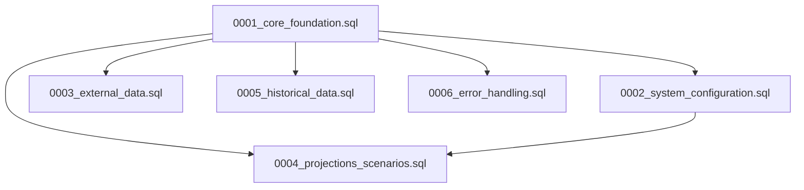
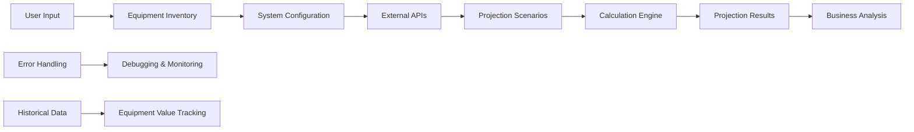

# Database Relationships Diagram

## Complete Database Schema

```mermaid
erDiagram
    %% Core Foundation (Migration 0001)
    users {
        integer id PK
        varchar email UK
        varchar password_hash
        varchar first_name
        varchar last_name
        boolean is_active
        datetime created_at
        datetime updated_at
    }

    locations {
        integer id PK
        integer user_id FK
        varchar name
        real latitude
        real longitude
        real elevation
        varchar timezone
        datetime created_at
    }

    miner_models {
        integer id PK
        integer user_id FK
        varchar manufacturer
        varchar model_name
        real hashrate_th
        integer power_consumption_w
        real efficiency_j_th
        real hashrate_degradation_annual
        real efficiency_degradation_annual
        real failure_rate_annual
        integer operating_temp_min
        integer operating_temp_max
        integer humidity_max
        real current_price_usd
        real expected_lifespan_years
        integer voltage_v
        varchar power_connection_type
        varchar user_nickname
        date purchase_date
        real purchase_price_usd
        date warranty_expiry
        text notes
        real estimated_resale_value_usd
        real depreciation_rate_annual
        real market_demand_factor
        real technology_obsolescence_factor
        date last_price_update_date
        boolean manual_price_override
        real manual_current_price_usd
        text manual_price_notes
        datetime created_at
        datetime updated_at
    }

    solar_panel_models {
        integer id PK
        integer user_id FK
        varchar manufacturer
        varchar model_name
        integer rated_power_w
        real efficiency_percent
        real temperature_coefficient
        real degradation_rate_annual
        real cost_per_watt
        real expected_lifespan_years
        varchar user_nickname
        date purchase_date
        real purchase_price_usd
        date installation_date
        date warranty_expiry
        text notes
        datetime created_at
        datetime updated_at
    }

    storage_models {
        integer id PK
        integer user_id FK
        varchar manufacturer
        varchar model_name
        varchar technology
        real capacity_kwh
        real usable_capacity_kwh
        real max_charge_rate_kw
        real max_discharge_rate_kw
        real round_trip_efficiency
        integer cycle_life
        real calendar_degradation_annual
        real cost_per_kwh
        varchar user_nickname
        date purchase_date
        real purchase_price_usd
        date installation_date
        date warranty_expiry
        text notes
        datetime created_at
    }

    inverter_models {
        integer id PK
        integer user_id FK
        varchar manufacturer
        varchar model_name
        integer rated_power_w
        real efficiency_percent
        varchar input_voltage_range
        integer output_voltage_v
        integer mppt_trackers
        real max_input_current_a
        real max_output_current_a
        real power_factor
        integer operating_temp_min
        integer operating_temp_max
        integer humidity_max
        real cost_usd
        real expected_lifespan_years
        varchar user_nickname
        date purchase_date
        real purchase_price_usd
        date installation_date
        date warranty_expiry
        text notes
        datetime created_at
        datetime updated_at
    }

    %% System Configuration (Migration 0002)
    system_configs {
        integer id PK
        integer user_id FK
        varchar config_name
        text description
        integer location_id FK
        json solar_panels
        json storage_systems
        json miners
        real electricity_rate_usd_kwh
        real net_metering_rate_usd_kwh
        varchar grid_connection_type
        varchar mining_mode
        real max_grid_power_kw
        json mining_schedule
        boolean auto_calculate_hours
        real manual_mining_hours_per_day
        integer inverter_id FK
        integer inverter_quantity
        datetime created_at
        datetime updated_at
    }

    %% External Data (Migration 0003)
    bitcoin_network_data {
        integer id PK
        date recorded_date
        bigint difficulty
        real network_hashrate
        real block_reward
        real avg_block_time
        real avg_transaction_fee
        varchar data_source
        real avg_transaction_fee_sat_vb
        real mempool_size_mb
        integer blocks_until_halving
        bigint next_difficulty_estimate
        real hashprice_usd_per_th
        real revenue_per_th_usd
        real profit_per_th_usd
        integer data_freshness_minutes
        datetime created_at
    }

    bitcoin_price_data {
        integer id PK
        date recorded_date
        real price_usd
        real volume_24h
        varchar data_source
        real market_cap_usd
        real volume_24h_usd
        real price_change_24h_percent
        real volatility_30d
        real price_change_7d_percent
        real price_change_30d_percent
        integer data_freshness_minutes
        datetime created_at
    }

    monthly_solar_data {
        integer id PK
        integer location_id FK
        integer year
        integer month
        real ghi_monthly_avg
        real dni_monthly_avg
        real sun_hours_monthly_avg
        real temperature_monthly_avg
        real temperature_min_monthly_avg
        real temperature_max_monthly_avg
        real humidity_monthly_avg
        real atmospheric_pressure_monthly_avg
        varchar season
        varchar data_source
        datetime created_at
    }

    daily_forecast_data {
        integer id PK
        integer location_id FK
        date forecast_date
        real ghi_forecast
        real temperature_forecast
        real cloud_cover_forecast
        real humidity_forecast
        real wind_speed_forecast
        real dni_forecast
        real sun_hours_forecast
        real temperature_min_forecast
        real temperature_max_forecast
        varchar weather_condition_forecast
        real atmospheric_pressure_forecast
        integer forecast_horizon_days
        real confidence_level
        varchar data_source
        integer data_freshness_minutes
        datetime created_at
    }

    hourly_forecast_data {
        integer id PK
        integer location_id FK
        datetime forecast_datetime
        real ghi_hourly_forecast
        real temperature_hourly_forecast
        real cloud_cover_hourly_forecast
        real dni_hourly_forecast
        real temperature_min_hourly_forecast
        real temperature_max_hourly_forecast
        real humidity_hourly_forecast
        varchar weather_condition_hourly_forecast
        real atmospheric_pressure_hourly_forecast
        integer forecast_horizon_hours
        real confidence_level
        varchar data_source
        integer data_freshness_minutes
        datetime created_at
    }

    api_data_sources {
        integer id PK
        varchar source_name UK
        text endpoint_url
        datetime last_fetch_time
        boolean is_active
        integer error_count
        text last_error_message
        datetime created_at
    }

    api_errors {
        integer id PK
        varchar source_name
        text error_message
        json error_data
        datetime created_at
    }

    %% Projections & Scenarios (Migration 0004)
    projection_scenarios {
        integer id PK
        integer user_id FK
        integer system_config_id FK
        varchar scenario_name
        text description
        json bitcoin_parameters
        json economic_parameters
        json environmental_parameters
        json equipment_parameters
        boolean is_baseline
        boolean is_active
        boolean is_user_created
        datetime created_at
        datetime updated_at
    }

    projection_results {
        integer id PK
        integer user_id FK
        integer system_config_id FK
        integer scenario_id FK
        date projection_date
        real total_generation_kwh
        real solar_generation_kwh
        real mining_consumption_kwh
        real grid_import_kwh
        real grid_export_kwh
        real total_hashrate_th
        real effective_hashrate_th
        real btc_mined
        real btc_price_usd
        real mining_revenue_usd
        real electricity_cost_usd
        real net_profit_usd
        real solar_capacity_factor
        real system_efficiency
        real solar_direct_to_mining_kwh
        real solar_wasted_kwh
        real mining_hours_solar_only
        real mining_hours_grid_assisted
        real effective_mining_hours
        real solar_availability_hours
        real mining_availability_percent
        varchar season
        real cloud_cover_avg_percent
        real weather_impact_factor
        real roi_percent
        real payback_period_months
        real net_present_value_usd
        real internal_rate_return_percent
        real break_even_btc_price_usd
        real break_even_electricity_rate_usd_kwh
        real equipment_depreciation_usd
        real maintenance_cost_usd
        real insurance_cost_usd
        real property_tax_usd
        real total_operating_cost_usd
        real gross_profit_margin_percent
        real net_profit_margin_percent
        real total_investment_usd
        real total_revenue_usd
        real total_costs_usd
        real cumulative_profit_usd
        real monthly_cash_flow_usd
        real annual_cash_flow_usd
        real equipment_resale_value_usd
        real total_investment_with_resale_usd
        real adjusted_roi_percent
        real net_equipment_value_usd
        datetime calculated_at
    }

    %% Historical Data (Migration 0005)
    miner_price_history {
        integer id PK
        integer user_id FK
        integer miner_model_id FK
        date recorded_date
        real market_price_usd
        real resale_price_usd
        varchar market_demand_level
        real depreciation_rate_used
        varchar calculation_method
        varchar data_source
        text notes
        datetime created_at
    }

    %% Error Handling (Migration 0006)
    application_errors {
        integer id PK
        integer user_id FK
        varchar error_type
        varchar error_category
        text error_message
        json error_context
        varchar severity_level
        text stack_trace
        text user_action
        varchar ip_address
        text user_agent
        datetime created_at
    }

    %% Relationships
    users ||--o{ locations : "has"
    users ||--o{ miner_models : "owns"
    users ||--o{ solar_panel_models : "owns"
    users ||--o{ storage_models : "owns"
    users ||--o{ inverter_models : "owns"
    users ||--o{ system_configs : "creates"
    users ||--o{ projection_scenarios : "creates"
    users ||--o{ projection_results : "calculates"
    users ||--o{ miner_price_history : "tracks"
    users ||--o{ application_errors : "generates"

    locations ||--o{ system_configs : "used_in"
    locations ||--o{ monthly_solar_data : "has"
    locations ||--o{ daily_forecast_data : "has"
    locations ||--o{ hourly_forecast_data : "has"

    system_configs ||--o{ projection_scenarios : "has"
    system_configs ||--o{ projection_results : "generates"
    system_configs }o--|| inverter_models : "uses"

    projection_scenarios ||--o{ projection_results : "generates"

    miner_models ||--o{ miner_price_history : "tracked_in"

    %% External data tables (no direct relationships to user data)
    api_data_sources ||--o{ api_errors : "generates"
```

## Key Features Highlighted

### User Data Isolation
- All user-related tables have `user_id` foreign keys
- Complete data isolation for multi-user support
- User-specific indexes for performance

### Equipment Management
- Comprehensive equipment specifications
- User-friendly fields (nicknames, notes, purchase info)
- Depreciation and value tracking
- Flexible JSON-based system configurations

### External Data Integration
- Bitcoin network and price data
- Environmental data (solar, weather, forecasts)
- API management and error tracking
- Data freshness monitoring

### Scenario-Based Analysis
- Baseline and custom scenarios
- JSON parameter overrides
- Comprehensive financial metrics
- Business analysis fields

### Error Handling
- Application error logging
- Error categorization and severity levels
- Context tracking and debugging support

### Performance Optimization
- Extensive indexing strategy
- Optimized for common query patterns
- User data isolation indexes
- Time-series data indexes

## Migration Dependencies

## Data Flow

This database schema provides a complete foundation for the Solar Bitcoin Mining Calculator with comprehensive user management, equipment tracking, external data integration, scenario-based analysis, and robust error handling.