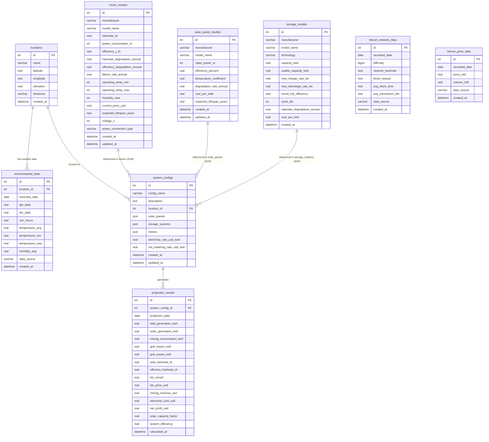

```mermaid
erDiagram
    %% Core Equipment Tables
    locations {
        int id PK
        varchar name
        real latitude
        real longitude
        real elevation
        varchar timezone
        datetime created_at
    }
    
    miner_models {
        int id PK
        varchar manufacturer
        varchar model_name
        real hashrate_th
        int power_consumption_w
        real efficiency_j_th
        real hashrate_degradation_annual
        real efficiency_degradation_annual
        real failure_rate_annual
        int operating_temp_min
        int operating_temp_max
        int humidity_max
        real current_price_usd
        real expected_lifespan_years
        int voltage_v
        varchar power_connection_type
        datetime created_at
        datetime updated_at
    }
    
    solar_panel_models {
        int id PK
        varchar manufacturer
        varchar model_name
        int rated_power_w
        real efficiency_percent
        real temperature_coefficient
        real degradation_rate_annual
        real cost_per_watt
        real expected_lifespan_years
        datetime created_at
        datetime updated_at
    }
    
    storage_models {
        int id PK
        varchar manufacturer
        varchar model_name
        varchar technology
        real capacity_kwh
        real usable_capacity_kwh
        real max_charge_rate_kw
        real max_discharge_rate_kw
        real round_trip_efficiency
        int cycle_life
        real calendar_degradation_annual
        real cost_per_kwh
        datetime created_at
    }
    
    %% Market Data Tables
    bitcoin_network_data {
        int id PK
        date recorded_date
        bigint difficulty
        real network_hashrate
        real block_reward
        real avg_block_time
        real avg_transaction_fee
        varchar data_source
        datetime created_at
    }
    
    bitcoin_price_data {
        int id PK
        date recorded_date
        real price_usd
        real volume_24h
        varchar data_source
        datetime created_at
    }
    
    environmental_data {
        int id PK
        int location_id FK
        date recorded_date
        real ghi_daily
        real dni_daily
        real sun_hours
        real temperature_avg
        real temperature_min
        real temperature_max
        real humidity_avg
        varchar data_source
        datetime created_at
    }
    
    %% User Configuration Tables
    system_configs {
        int id PK
        varchar config_name
        text description
        int location_id FK
        json solar_panels
        json storage_systems
        json miners
        real electricity_rate_usd_kwh
        real net_metering_rate_usd_kwh
        datetime created_at
        datetime updated_at
    }
    
    projection_results {
        int id PK
        int system_config_id FK
        date projection_date
        real total_generation_kwh
        real solar_generation_kwh
        real mining_consumption_kwh
        real grid_import_kwh
        real grid_export_kwh
        real total_hashrate_th
        real effective_hashrate_th
        real btc_mined
        real btc_price_usd
        real mining_revenue_usd
        real electricity_cost_usd
        real net_profit_usd
        real solar_capacity_factor
        real system_efficiency
        datetime calculated_at
    }
    
    %% Relationships
    locations ||--o{ environmental_data : "has weather data"
    locations ||--o{ system_configs : "located at"
    system_configs ||--o{ projection_results : "generates"
    
    %% Implicit JSON references (not enforced by FK constraints)
    miner_models ||--o{ system_configs : "referenced in miners JSON"
    solar_panel_models ||--o{ system_configs : "referenced in solar_panels JSON"
    storage_models ||--o{ system_configs : "referenced in storage_systems JSON"
```