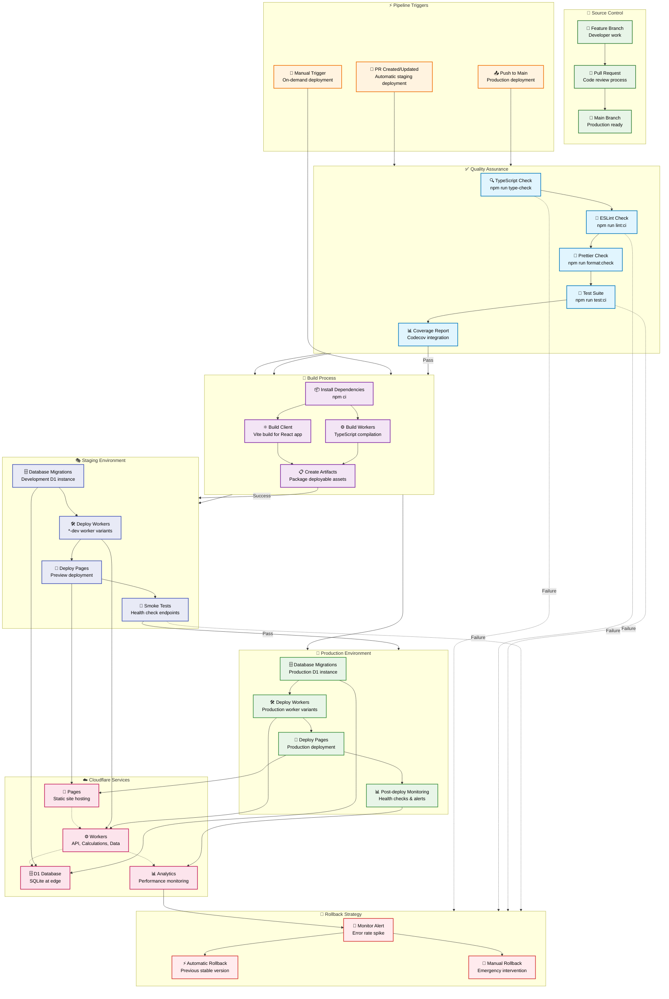

```mermaid
graph TD
    %% Source Control
    subgraph SOURCE["📁 Source Control"]
        direction TB
        DEV_BRANCH["🌿 Feature Branch<br/>Developer work"]
        MAIN_BRANCH["🎯 Main Branch<br/>Production ready"]
        PR["🔄 Pull Request<br/>Code review process"]
        
        DEV_BRANCH --> PR
        PR --> MAIN_BRANCH
    end
    
    %% Trigger Events
    subgraph TRIGGERS["⚡ Pipeline Triggers"]
        direction TB
        PR_TRIGGER["📝 PR Created/Updated<br/>Automatic staging deployment"]
        PUSH_TRIGGER["📤 Push to Main<br/>Production deployment"]
        MANUAL_TRIGGER["👤 Manual Trigger<br/>On-demand deployment"]
    end
    
    %% Quality Gates
    subgraph QUALITY["✅ Quality Assurance"]
        direction TB
        TYPE_CHECK["🔍 TypeScript Check<br/>npm run type-check"]
        LINT_CHECK["📏 ESLint Check<br/>npm run lint:ci"]
        FORMAT_CHECK["💅 Prettier Check<br/>npm run format:check"]
        TEST_SUITE["🧪 Test Suite<br/>npm run test:ci"]
        COVERAGE["📊 Coverage Report<br/>Codecov integration"]
        
        TYPE_CHECK --> LINT_CHECK
        LINT_CHECK --> FORMAT_CHECK
        FORMAT_CHECK --> TEST_SUITE
        TEST_SUITE --> COVERAGE
    end
    
    %% Build Process
    subgraph BUILD["🔨 Build Process"]
        direction TB
        INSTALL_DEPS["📦 Install Dependencies<br/>npm ci"]
        BUILD_CLIENT["⚛️ Build Client<br/>Vite build for React app"]
        BUILD_WORKERS["⚙️ Build Workers<br/>TypeScript compilation"]
        BUILD_ARTIFACTS["📋 Create Artifacts<br/>Package deployable assets"]
        
        INSTALL_DEPS --> BUILD_CLIENT
        INSTALL_DEPS --> BUILD_WORKERS
        BUILD_CLIENT --> BUILD_ARTIFACTS
        BUILD_WORKERS --> BUILD_ARTIFACTS
    end
    
    %% Deployment Environments
    subgraph STAGING["🎭 Staging Environment"]
        direction TB
        STAGE_WORKERS["🛠️ Deploy Workers<br/>*-dev worker variants"]
        STAGE_PAGES["📄 Deploy Pages<br/>Preview deployment"]
        STAGE_DB["🗄️ Database Migrations<br/>Development D1 instance"]
        STAGE_TEST["🧪 Smoke Tests<br/>Health check endpoints"]
        
        STAGE_DB --> STAGE_WORKERS
        STAGE_WORKERS --> STAGE_PAGES
        STAGE_PAGES --> STAGE_TEST
    end
    
    subgraph PRODUCTION["🚀 Production Environment"]
        direction TB
        PROD_DB["🗄️ Database Migrations<br/>Production D1 instance"]
        PROD_WORKERS["🛠️ Deploy Workers<br/>Production worker variants"]
        PROD_PAGES["📄 Deploy Pages<br/>Production deployment"]
        PROD_MONITOR["📊 Post-deploy Monitoring<br/>Health checks & alerts"]
        
        PROD_DB --> PROD_WORKERS
        PROD_WORKERS --> PROD_PAGES
        PROD_PAGES --> PROD_MONITOR
    end
    
    %% Rollback Strategy
    subgraph ROLLBACK["🔄 Rollback Strategy"]
        direction TB
        MONITOR_ALERT["🚨 Monitor Alert<br/>Error rate spike"]
        AUTO_ROLLBACK["⚡ Automatic Rollback<br/>Previous stable version"]
        MANUAL_ROLLBACK["👤 Manual Rollback<br/>Emergency intervention"]
        
        MONITOR_ALERT --> AUTO_ROLLBACK
        MONITOR_ALERT --> MANUAL_ROLLBACK
    end
    
    %% Cloudflare Services
    subgraph CLOUDFLARE["☁️ Cloudflare Services"]
        direction TB
        CF_WORKERS["⚙️ Workers<br/>API, Calculations, Data"]
        CF_PAGES["📄 Pages<br/>Static site hosting"]
        CF_D1["🗄️ D1 Database<br/>SQLite at edge"]
        CF_ANALYTICS["📊 Analytics<br/>Performance monitoring"]
        
        CF_WORKERS -.-> CF_D1
        CF_PAGES -.-> CF_WORKERS
        CF_WORKERS -.-> CF_ANALYTICS
    end
    
    %% Pipeline Flow
    
    %% Development Flow
    PR_TRIGGER --> QUALITY
    QUALITY --> BUILD
    BUILD --> STAGING
    
    %% Production Flow  
    PUSH_TRIGGER --> QUALITY
    QUALITY --> BUILD
    BUILD --> PRODUCTION
    
    %% Manual Override
    MANUAL_TRIGGER --> BUILD
    
    %% Deployment Targets
    STAGE_WORKERS --> CF_WORKERS
    STAGE_PAGES --> CF_PAGES
    STAGE_DB --> CF_D1
    
    PROD_WORKERS --> CF_WORKERS
    PROD_PAGES --> CF_PAGES
    PROD_DB --> CF_D1
    
    %% Monitoring and Rollback
    PROD_MONITOR --> CF_ANALYTICS
    CF_ANALYTICS --> MONITOR_ALERT
    
    %% Quality Gate Failures (dotted red lines)
    TYPE_CHECK -.->|"Failure"| ROLLBACK
    LINT_CHECK -.->|"Failure"| ROLLBACK
    TEST_SUITE -.->|"Failure"| ROLLBACK
    STAGE_TEST -.->|"Failure"| ROLLBACK
    
    %% Success Paths (solid green lines)
    COVERAGE -->|"Pass"| BUILD
    BUILD_ARTIFACTS -->|"Success"| STAGING
    STAGE_TEST -->|"Pass"| PRODUCTION
    
    %% Styling
    classDef sourceNode fill:#e8f5e8,stroke:#2e7d32,stroke-width:2px,color:#000
    classDef triggerNode fill:#fff3e0,stroke:#ef6c00,stroke-width:2px,color:#000
    classDef qualityNode fill:#e1f5fe,stroke:#0277bd,stroke-width:2px,color:#000
    classDef buildNode fill:#f3e5f5,stroke:#7b1fa2,stroke-width:2px,color:#000
    classDef stagingNode fill:#e8eaf6,stroke:#3f51b5,stroke-width:2px,color:#000
    classDef productionNode fill:#e8f5e8,stroke:#388e3c,stroke-width:2px,color:#000
    classDef rollbackNode fill:#ffebee,stroke:#d32f2f,stroke-width:2px,color:#000
    classDef cloudflareNode fill:#fce4ec,stroke:#c2185b,stroke-width:2px,color:#000
    
    class DEV_BRANCH,MAIN_BRANCH,PR sourceNode
    class PR_TRIGGER,PUSH_TRIGGER,MANUAL_TRIGGER triggerNode
    class TYPE_CHECK,LINT_CHECK,FORMAT_CHECK,TEST_SUITE,COVERAGE qualityNode
    class INSTALL_DEPS,BUILD_CLIENT,BUILD_WORKERS,BUILD_ARTIFACTS buildNode
    class STAGE_WORKERS,STAGE_PAGES,STAGE_DB,STAGE_TEST stagingNode
    class PROD_DB,PROD_WORKERS,PROD_PAGES,PROD_MONITOR productionNode
    class MONITOR_ALERT,AUTO_ROLLBACK,MANUAL_ROLLBACK rollbackNode
    class CF_WORKERS,CF_PAGES,CF_D1,CF_ANALYTICS cloudflareNode
```