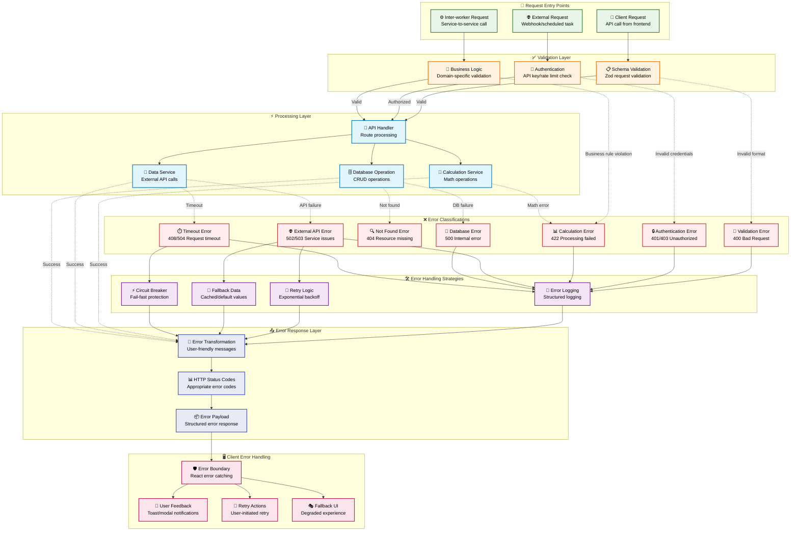

```mermaid
graph TD
    %% Request Entry Points
    subgraph ENTRY["🚪 Request Entry Points"]
        direction TB
        CLIENT_REQ["📱 Client Request<br/>API call from frontend"]
        EXT_REQ["🌐 External Request<br/>Webhook/scheduled task"]
        WORKER_REQ["⚙️ Inter-worker Request<br/>Service-to-service call"]
    end
    
    %% Validation Layer
    subgraph VALIDATION["✅ Validation Layer"]
        direction TB
        SCHEMA_VAL["📋 Schema Validation<br/>Zod request validation"]
        AUTH_VAL["🔐 Authentication<br/>API key/rate limit check"]
        BUSINESS_VAL["🧠 Business Logic<br/>Domain-specific validation"]
    end
    
    %% Processing Layer
    subgraph PROCESSING["⚡ Processing Layer"]
        direction TB
        API_HANDLER["🔗 API Handler<br/>Route processing"]
        CALC_SERVICE["🧮 Calculation Service<br/>Math operations"]
        DATA_SERVICE["📡 Data Service<br/>External API calls"]
        DB_OPERATION["🗄️ Database Operation<br/>CRUD operations"]
    end
    
    %% Error Types
    subgraph ERROR_TYPES["❌ Error Classifications"]
        direction TB
        VALIDATION_ERR["🚫 Validation Error<br/>400 Bad Request"]
        AUTH_ERR["🔒 Authentication Error<br/>401/403 Unauthorized"]
        NOT_FOUND_ERR["🔍 Not Found Error<br/>404 Resource missing"]
        CALC_ERR["📊 Calculation Error<br/>422 Processing failed"]
        EXT_API_ERR["🌐 External API Error<br/>502/503 Service issues"]
        DB_ERR["💾 Database Error<br/>500 Internal error"]
        TIMEOUT_ERR["⏱️ Timeout Error<br/>408/504 Request timeout"]
    end
    
    %% Error Handling Strategies
    subgraph HANDLING["🛠️ Error Handling Strategies"]
        direction TB
        RETRY_LOGIC["🔄 Retry Logic<br/>Exponential backoff"]
        FALLBACK["🔀 Fallback Data<br/>Cached/default values"]
        CIRCUIT_BREAKER["⚡ Circuit Breaker<br/>Fail-fast protection"]
        ERROR_LOG["📝 Error Logging<br/>Structured logging"]
    end
    
    %% Response Layer
    subgraph RESPONSE["📤 Error Response Layer"]
        direction TB
        ERROR_TRANSFORM["🔄 Error Transformation<br/>User-friendly messages"]
        STATUS_CODE["📊 HTTP Status Codes<br/>Appropriate error codes"]
        ERROR_PAYLOAD["📦 Error Payload<br/>Structured error response"]
    end
    
    %% Client Handling
    subgraph CLIENT_HANDLING["🖥️ Client Error Handling"]
        direction TB
        ERROR_BOUNDARY["🛡️ Error Boundary<br/>React error catching"]
        USER_FEEDBACK["💬 User Feedback<br/>Toast/modal notifications"]
        RETRY_UI["🔄 Retry Actions<br/>User-initiated retry"]
        FALLBACK_UI["🎭 Fallback UI<br/>Degraded experience"]
    end
    
    %% Request Flow with Error Paths
    CLIENT_REQ --> SCHEMA_VAL
    EXT_REQ --> AUTH_VAL
    WORKER_REQ --> BUSINESS_VAL
    
    %% Validation Errors
    SCHEMA_VAL -.->|"Invalid format"| VALIDATION_ERR
    AUTH_VAL -.->|"Invalid credentials"| AUTH_ERR
    BUSINESS_VAL -.->|"Business rule violation"| CALC_ERR
    
    %% Processing Errors
    SCHEMA_VAL -->|"Valid"| API_HANDLER
    AUTH_VAL -->|"Authorized"| API_HANDLER
    BUSINESS_VAL -->|"Valid"| API_HANDLER
    
    API_HANDLER --> CALC_SERVICE
    API_HANDLER --> DATA_SERVICE
    API_HANDLER --> DB_OPERATION
    
    CALC_SERVICE -.->|"Math error"| CALC_ERR
    DATA_SERVICE -.->|"API failure"| EXT_API_ERR
    DATA_SERVICE -.->|"Timeout"| TIMEOUT_ERR
    DB_OPERATION -.->|"DB failure"| DB_ERR
    DB_OPERATION -.->|"Not found"| NOT_FOUND_ERR
    
    %% Error Handling Flow
    EXT_API_ERR --> RETRY_LOGIC
    EXT_API_ERR --> FALLBACK
    TIMEOUT_ERR --> CIRCUIT_BREAKER
    
    VALIDATION_ERR --> ERROR_LOG
    AUTH_ERR --> ERROR_LOG
    CALC_ERR --> ERROR_LOG
    EXT_API_ERR --> ERROR_LOG
    DB_ERR --> ERROR_LOG
    TIMEOUT_ERR --> ERROR_LOG
    
    %% Response Generation
    ERROR_LOG --> ERROR_TRANSFORM
    RETRY_LOGIC --> ERROR_TRANSFORM
    FALLBACK --> ERROR_TRANSFORM
    CIRCUIT_BREAKER --> ERROR_TRANSFORM
    
    ERROR_TRANSFORM --> STATUS_CODE
    STATUS_CODE --> ERROR_PAYLOAD
    
    %% Client Error Handling
    ERROR_PAYLOAD --> ERROR_BOUNDARY
    ERROR_BOUNDARY --> USER_FEEDBACK
    ERROR_BOUNDARY --> RETRY_UI
    ERROR_BOUNDARY --> FALLBACK_UI
    
    %% Success Path (dotted green)
    CALC_SERVICE -.->|"Success"| ERROR_TRANSFORM
    DATA_SERVICE -.->|"Success"| ERROR_TRANSFORM
    DB_OPERATION -.->|"Success"| ERROR_TRANSFORM
    
    %% Styling
    classDef entryNode fill:#e8f5e8,stroke:#2e7d32,stroke-width:2px,color:#000
    classDef validationNode fill:#fff3e0,stroke:#ef6c00,stroke-width:2px,color:#000
    classDef processingNode fill:#e1f5fe,stroke:#0277bd,stroke-width:2px,color:#000
    classDef errorNode fill:#ffebee,stroke:#d32f2f,stroke-width:2px,color:#000
    classDef handlingNode fill:#f3e5f5,stroke:#7b1fa2,stroke-width:2px,color:#000
    classDef responseNode fill:#e8eaf6,stroke:#3f51b5,stroke-width:2px,color:#000
    classDef clientNode fill:#fce4ec,stroke:#c2185b,stroke-width:2px,color:#000
    
    class CLIENT_REQ,EXT_REQ,WORKER_REQ entryNode
    class SCHEMA_VAL,AUTH_VAL,BUSINESS_VAL validationNode
    class API_HANDLER,CALC_SERVICE,DATA_SERVICE,DB_OPERATION processingNode
    class VALIDATION_ERR,AUTH_ERR,NOT_FOUND_ERR,CALC_ERR,EXT_API_ERR,DB_ERR,TIMEOUT_ERR errorNode
    class RETRY_LOGIC,FALLBACK,CIRCUIT_BREAKER,ERROR_LOG handlingNode
    class ERROR_TRANSFORM,STATUS_CODE,ERROR_PAYLOAD responseNode
    class ERROR_BOUNDARY,USER_FEEDBACK,RETRY_UI,FALLBACK_UI clientNode
```